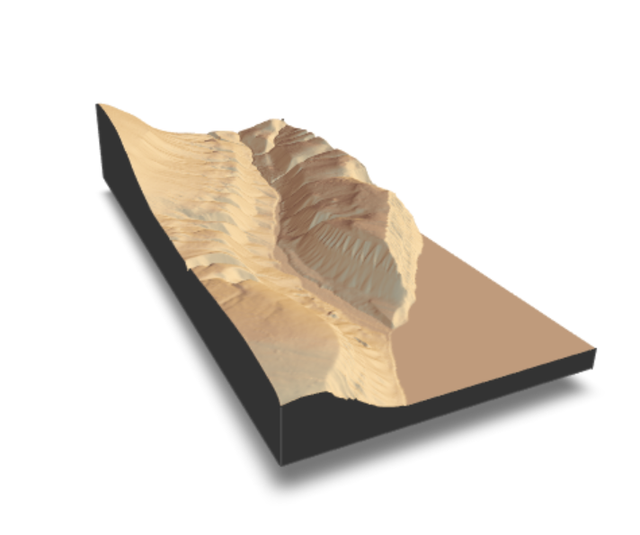
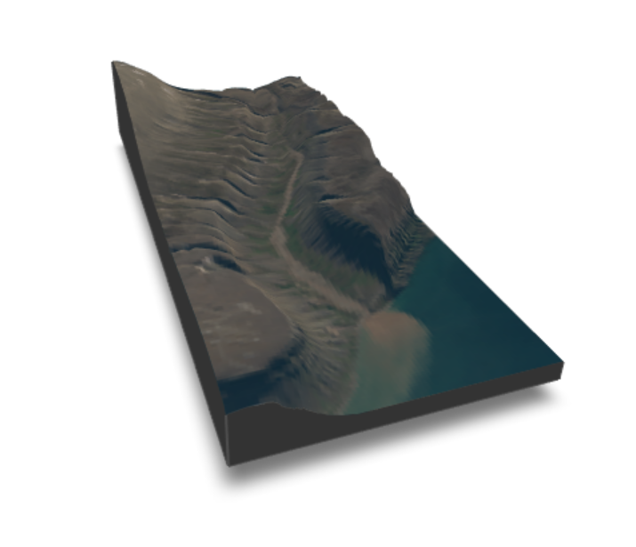
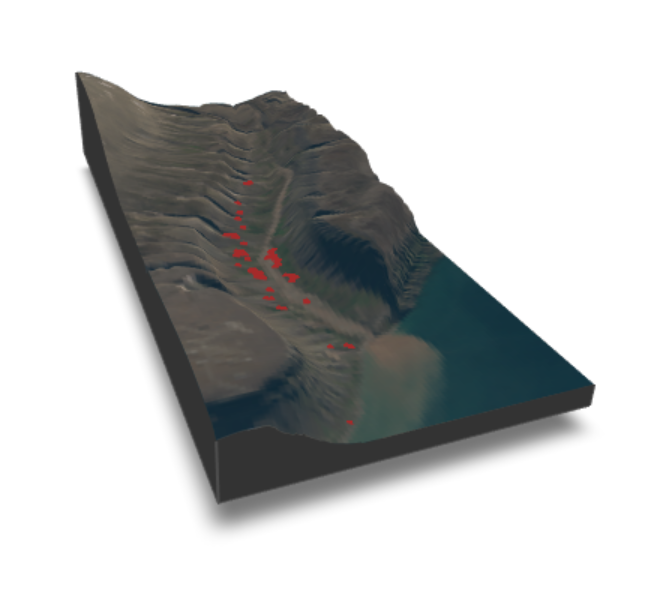

### **About thid tutorial**
Here you can find a quick tutorial how to create 3D maps from a Digital Elevation Model (DEM). This example creates a map of Bjørndalen and adds point locations of reindeer to the 3D map.

Keep in mind that 3D maps are a good method to visualize data, however they are often not scientific. So think about for which purpose you create this map.

For more tutorials check the [rayshader website](https://www.rayshader.com/) or look online.

**Note:** This website is only capable of automatically generatic 2D figures. All 3D images are screenshots. When using these examples in R Studio the 3D maps are interactive.

#### **Install required packages**
This is only necessary once, when the packages have never been installed before.
```{r install packages, message=FALSE, warning=FALSE}
#install.packages("terra")
#install.packages("sf")
#install.packages("rayshader")
#install.packages("magick")
#install.packages("tidyverse")
```


#### **Load required packages**
The creation of 3D plots is an advanced way of visualising data. Therefore there are multiple packages need:

- terra: For working with raster data
- sf: For working with vector data
- rayshader: For visualization of elevation data in 2D and 3D
- magick: For working with image data

```{r load packages, message=FALSE, warning=FALSE}
library(terra)
library(sf)
library(rayshader)
library(magick)
library(tidyverse)
```

The main input data for the visulaization is a DEM, here we use the DEM of Svalbard provided by the Norsk Polar Institude. You can download it [here](https://data.npolar.no/dataset/dce53a47-c726-4845-85c3-a65b46fe2fea).

We use `rast()` to load the .tif file. It is usually a very big file so the first thing is that we crop it to the extent that we need - here Bjørndalen via a bounding box. 

Then we create a simple figure using the base R function `plot()` and save the cropped raster to a new file with the *terra* function `writeRaster()`.

```{r}
# Load DEM from Norsk Polar institute
dem_path <- "/Users/ronja/Documents/EAGLE/Svalbard/Data/Basemap/NP_S0_DTM20/S0_DTM20.tif" #create a variable with the link to the DEM
dem_raster <- rast(dem_path) #load the DEM as spatial raster file into R 

# Define coordinate system (crs) for the bounding box (UTM Zone 33N)
utm_zone <- 33
utm_crs <- paste0("+proj=utm +zone=", utm_zone, " +datum=WGS84 +units=m +no_defs")

# Define bounding box (all 4 corners)for bjorndalen in UTM coordinate system
utm_bbox <- st_sfc(st_polygon(list(matrix(c(
  505000, 8676038,
  509000, 8676038,
  509000, 8684990,
  505000, 8684990,
  505000, 8676038
), ncol = 2, byrow = TRUE))), crs = utm_crs)

# Crop DEM to bounding box
dem_bjorndalen <- crop(dem_raster, utm_bbox)

#plot a simple figure of the cropped DEM in grey color scale
plot(dem_bjorndalen, main = "Digital Elevation Model of Bjørndalen", 
     col = gray.colors(1000, start = 0, end = 1), 
     xlab = "Easting", ylab ="Northing")

#save this cropped raster file to a folder
writeRaster(dem_bjorndalen, "data/bjorndalen_dem.tif", overwrite = TRUE)

```

To use the DEM with *rayshader* it has to be tranformed into a matrix (`raster_to_matrix()`). Then the rayshader function `sphere_shade()` is used to create a shaded relief which is used to plot both a 2D plot (`plot_map()`) and a 3D plot (`plot_3d()`).

You can change the title text or play around with the scaling of the 3D plot.

```{r}
# Convert DEM to matrix
dem_bjorndalen <- rast("data/bjorndalen_dem.tif")
bjorndalen <- raster_to_matrix(dem_bjorndalen)

# Create shaded relief. "Desert" is an example but you can find more textures in the internet.
bjorndalen_shade <- sphere_shade(bjorndalen, texture = "desert")

# 2D map
plot_map(bjorndalen_shade, 
         title_text = "Bjørndalen Shiny\n Elevation Map",
         title_size = 20)

# 3D map (run in RStudio)
plot_3d(bjorndalen_shade, bjorndalen, zscale = 15, fov = 60, theta = 45, phi = 45)
```
This image is a screenshot of the 3D map created before. Use the code on your personal computer to create an interactive 3D map and change the scaling parameters. 



----

Now we want to have an Orthophoto as overlay for the 3D image. For this I used the [Satellittbildemosaikk av Svalbard (Sentinel2, 2020)](https://data.npolar.no/dataset/e02f479b-fbb8-4860-ab8d-c5e0bbbf559c) by the Norsk Polar institute and cropped it to the Bounding box. You can download the cropped image from the linked [github repository](https://github.com/RonjaAnn/BIG_website/tree/main/data) or do the same as before, when cropping the DEM to the Bounding Box.

```{r}
# Load orthophoto using the magick package and preprocess the image 
orthophoto <- image_read("data/Ortophoto_Bjorndalen.tif") %>% #read the image
  image_resize(paste0(ncol(bjorndalen), "x", nrow(bjorndalen))) %>%  #resize to match dimensions of dem
  image_data() #convert into 3D array with RGB channel for the use in rayshader

orthophoto_rgb <- drop(as.numeric(orthophoto)) #convert to numeric format

bjorndalen_ortho_shade <- rayshader::add_overlay(bjorndalen_shade, orthophoto_rgb) #create an overlay of an RGB image on top of a hillshade terrain model

# 3D map with RGB overlay
plot_3d(bjorndalen_ortho_shade, bjorndalen, zscale = 15, fov = 60, theta = 45, phi = 45)
```

This code created a 3D figure with a RGB overlay. Try it in your own code to inspect it more closely!


----

The final step is to visualize some reindeer locations. For this add points as a geopackage (.gpkg) via the `vect()` function. Then crop it to the extent of our area of interest (AOI) (`crop()`).

```{r}
data_points <- vect("data/BjorndalenReindeer_Points.gpkg") #add reindeer locations from a point file 
data_cropped <- crop(data_points, dem_bjorndalen) #crop the files to the extent that we are looking at (crop point to raster)

# Extract coordinates because we need them as separate variables
coords_x <- geom(data_cropped)[, c("x")]
coords_y <- geom(data_cropped)[, c("y")]

# Add 3D points and render them on our 3D plot of Bjorndalen
render_points(lat = coords_y, long = coords_x,
              heightmap = bjorndalen,
              zscale = 15, color = "brown",
              extent = ext(dem_bjorndalen),
              offset = 1,
              clear_previous = TRUE,
              size = 5)
```

The result is a final map which shows the locations of reindeer observations in Bjørndalen. 

What do you think? Are the results plausible? Where were the most sightings of reindeer?



----

Using the function `sessionInfo()` gives insight into the R version, platform, packages and local settings to increase reproducibility and is good practice to include at the end of scripts.
```{r Session Info} 
sessionInfo() 
```